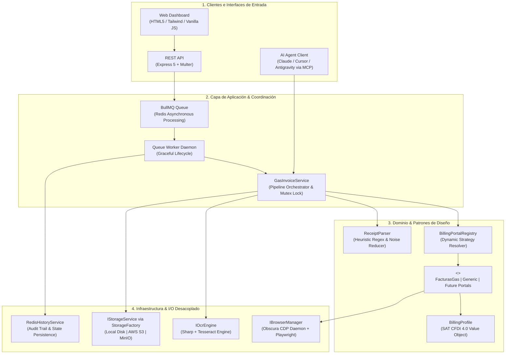
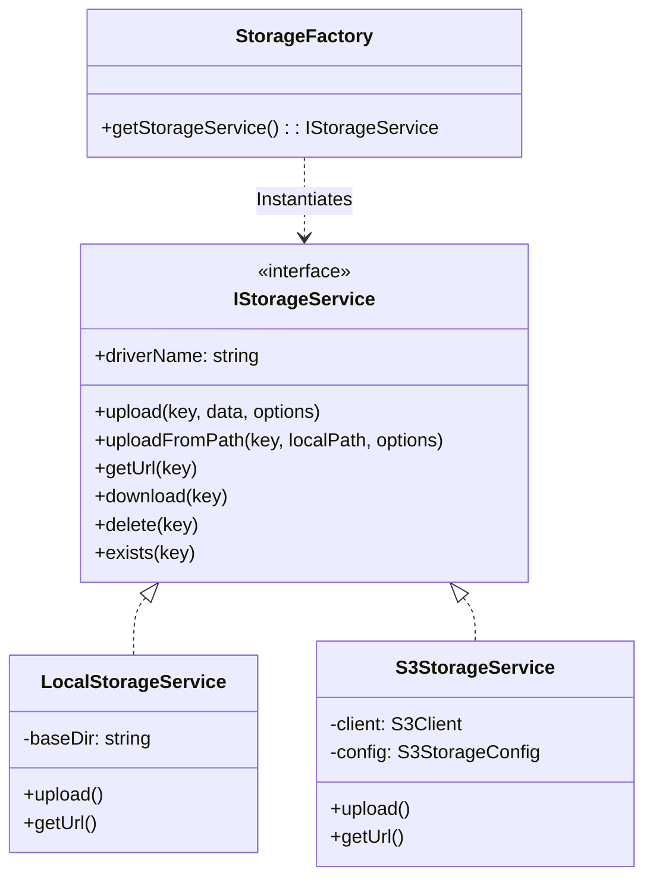

<div align="center">

# ⚡ CombusTicket

### Automated Fuel Billing Agent & Microservice
**Clean Architecture · SOLID · Strategy Pattern · Playwright CDP Stealth · BullMQ · MCP**

[](https://www.typescriptlang.org/)
[](https://nodejs.org/)
[](https://playwright.dev/)
[](https://www.docker.com/)
[](https://redis.io/)
[](https://modelcontextprotocol.io/)

<p align="center">
  <b>Plataforma enterprise de facturación electrónica desatendida para estaciones de combustible en México.</b><br>
  Combina visión computacional (OCR heurístico), evasión anti-bot a bajo nivel mediante CDP, arquitectura distribuida por colas y adaptadores polimórficos desacoplados.
</p>

[Arquitectura](#-arquitectura-del-sistema) •
[Engineering Highlights](#-engineering-highlights-por-qué-destaca-este-proyecto) •
[Storage Subsystem](#-almacenamiento-pluggable-local--s3--minio) •
[Quickstart](#-inicio-rápido) •
[Despliegue](#-despliegue-en-producción-easypanel--docker) •
[API & MCP](#-api-rest--model-context-protocol-mcp)

---

</div>

## 🎯 El Problema y la Solución

### El Problema
La facturación de gasolina en México (CFDI 4.0) está fragmentada en cientos de portales web propietarios (GOGAS, FacturasGas, OXXO Gas, Hidrosina, Petro-7), cada uno con:
- Interfaces arcaicas y sin APIs públicas.
- Retos agresivos de validación y bloqueos anti-bot.
- Campos fiscales inconsistentes y propensos a error humano.
- Procesos manuales que le cuestan horas a transportistas, empresas y profesionistas.

### La Solución: CombusTicket
Un servicio de automatización end-to-end diseñado con estándares de ingeniería de software senior:
1. **Ingesta Inteligente:** Carga de imágenes de tickets vía Web UI, REST API o agentes de IA mediante el protocolo MCP.
2. **Extracción Resiliente:** Pipeline OCR local preprocesado con Sharp y Tesseract, con tolerancia a arrugas, baja iluminación y ruido de impresión térmica.
3. **Despacho Polimórfico:** Un registro dinámico resuelve el portal correspondiente mediante el patrón **Strategy**.
4. **Navegación Anti-Detección:** Un browser headless custom (**Obscura**) instrumentado vía Chrome DevTools Protocol (CDP) con fingerprinting aleatorizado completa y timbra la factura en segundos.
5. **Auditoría Transparente:** Grabación en video de la sesión web, capturas de pantalla de evidencia y descarga directa del comprobante PDF en almacenamiento local o S3/MinIO.

---

## 🏛 Arquitectura del Sistema

El proyecto implementa **Clean Architecture (Onion / Hexagonal)** para asegurar que las reglas de negocio permanezcan 100% aisladas de navegadores, frameworks HTTP o servicios de almacenamiento en la nube.



---

## 💎 Engineering Highlights: Por qué destaca este proyecto

Este repositorio fue construido demostrando disciplina arquitectónica de nivel **Staff / Senior Software Engineer**:

### 1. Principios SOLID Aplicados Rigurosamente
- **Single Responsibility (SRP):** Cada módulo posee una única causa de modificación. El parsing de tickets (`ReceiptParser`) no conoce a Playwright; el adaptador web no sabe si el almacenamiento es un disco local o un bucket S3.
- **Open / Closed (OCP):** Agregar una gasolinera nueva toma **15 líneas de código** creando una clase que implemente `IBillingPortalAdapter` y registrándola en `BillingPortalRegistry`, sin modificar ni una sola línea del orquestador.
- **Liskov Substitution (LSP):** Cualquier adaptador es intercambiable en tiempo de ejecución sin alterar el contrato `adapter.execute(page, receipt, profile)`.
- **Interface Segregation (ISP):** Interfaces pequeñas y de propósito único: `IOcrEngine`, `IBrowserManager`, `IStorageService`, `IBillingPortalAdapter`.
- **Dependency Inversion (DIP):** El orquestador depende exclusivamente de interfaces abstractas resueltas mediante Factories (`StorageFactory`, `OcrEngineFactory`).

### 2. Control de Concurrencia y Evasión Anti-Detección
- **CDP Mutex Lock:** Para prevenir colisiones en los puertos de depuración CDP al operar con navegadores automatizados, el orquestador implementa un mutex de promesa FIFO que encola ejecuciones a nivel de proceso.
- **Obscura Daemon:** Ejecuta una instancia de Chromium con parámetros de evasión de fingerprints (User-Agent real, flags de automatización eliminados, emulación de WebGL y canvas) que evita los bloqueos de WAFs comunes como Cloudflare o Akamai.
- **Auditoría en Video:** Genera trazabilidad forense grabando video WebM sincronizado de la navegación para validar ante clientes o soporte cualquier rechazo del portal.

### 3. Patrón Dual-Role Container
La misma imagen Docker puede operar en tres roles distintos usando la variable `APP_MODE`:
- `web`: Solo atiende solicitudes HTTP y sirve la UI interactiva (desacoplado para escalar en pods web).
- `worker`: Solo consume y procesa tareas de la cola BullMQ (escalable horizontalmente según la carga).
- `all`: Monolítico para despliegues ligeros y desarrollo local.

### 4. Preparado para la Era de Agentes de IA (MCP)
Incorpora un servidor nativo de **Model Context Protocol (MCP)** implementado con `@modelcontextprotocol/sdk`. Cualquier agente de IA (Claude Desktop, Cursor, Agentes de Antigravity) puede invocar directamente las tools `parse_receipt` o `invoice_receipt` de forma autónoma.

---

## 💾 Almacenamiento Pluggable (Local / S3 / MinIO)

El almacenamiento se abstrae mediante la interfaz [IStorageService](file:///src/core/interfaces/IStorageService.ts) y se conmuta en tiempo de ejecución con `STORAGE_DRIVER`:



### Modos Soportados en `.env`:

#### A. Disco Local (Predeterminado)
```bash
STORAGE_DRIVER=local
SCREENSHOT_DIR=output
VIDEO_DIR=output/videos
```
*Los archivos se guardan en el servidor y se exponen en `/output/*`.*

#### B. AWS S3
```bash
STORAGE_DRIVER=s3
S3_BUCKET=mi-bucket-combusticket
S3_REGION=us-east-1
S3_ACCESS_KEY_ID=AKIA...
S3_SECRET_ACCESS_KEY=...
S3_FORCE_PATH_STYLE=false
# Opcional para CloudFront o CDN:
# S3_PUBLIC_URL=https://cdn.tudominio.com
```

#### C. MinIO / S3-Compatible
```bash
STORAGE_DRIVER=minio
S3_ENDPOINT=http://minio:9000       # En local usa http://127.0.0.1:9000
S3_BUCKET=combusticket
S3_ACCESS_KEY_ID=minioadmin
S3_SECRET_ACCESS_KEY=minioadmin
S3_FORCE_PATH_STYLE=true
```

> [!TIP]
> Todos los archivos (imágenes de recibos, screenshots de auditoría, videos WebM y facturas PDF) se organizan en prefijos canónicos: `receipts/`, `screenshots/`, `videos/`, e `invoices/`.

---

## 🚀 Inicio Rápido

### Prerrequisitos
- Node.js 20+ LTS
- Docker & Docker Compose (Recomendado)
- Redis 7+ (para encolamiento BullMQ)

### 1. Clonar e Instalar
```bash
git clone https://github.com/rrortega/combusticket.git
cd combusticket
npm install
```

### 2. Levantar con Docker Compose (Recomendado)
Levanta **Redis**, el servidor **Web** y el **Worker asíncrono** con un solo comando:
```bash
docker compose up -d --build
```
Abre tu navegador en [http://localhost:4000](http://localhost:4000).

### 3. Ejecución Directa en Desarrollo
```bash
# Copiar variables de entorno
cp .env.example .env

# Compilar TypeScript
npm run build

# Iniciar servidor Web + Worker monolítico
npm run start
```

---

## 🚢 Despliegue en Producción (Easypanel & Docker)

### 1. Flujo CI/CD Automático (GitHub Actions + GHCR)
El repositorio incluye [.github/workflows/deploy.yml](file:///.github/workflows/deploy.yml). Cada `git push` a `main`:
1. Compila la imagen con Chromium y dependencias nativas de Linux.
2. Publica la imagen en **GitHub Container Registry (GHCR)**:
   ```text
   ghcr.io/rrortega/combusticket:latest
   ```
3. Dispara los webhooks de despliegue en **Easypanel** para un deploy con cero downtime.

---

### 2. Configuración en Easypanel

```
┌─────────────────────────────────────────────────────────────┐
│                       EASYPANEL                             │
│                                                             │
│   ┌───────────────┐     ┌───────────────┐     ┌─────────┐   │
│   │ combusticket  │ ──> │ combusticket  │ ──> │  Redis  │   │
│   │     -web      │     │    -worker    │     └─────────┘   │
│   │    (:4000)    │     │   (BullMQ)    │          ▲        │
│   └───────┬───────┘     └───────┬───────┘          │        │
│           │                     │                  │        │
│           ▼                     ▼                  │        │
│      ┌───────────────────────────────┐             │        │
│      │   MinIO / S3 Storage Bucket   │ ────────────┘        │
│      └───────────────────────────────┘                      │
└─────────────────────────────────────────────────────────────┘
```

#### Paso 1: Servicios de Base de Datos y Storage
- Crea un servicio **Redis** (ej. nombre: `redis`). La URL interna será `redis://redis:6379`.
- *(Opcional)* Crea un servicio **MinIO** y crea el bucket `combusticket`.

#### Paso 2: Servicio CombusTicket
1. En Easypanel: **+ Service** ➔ **App**.
2. En **Source** selecciona **Docker Image**.
3. En **Image Name** ingresa:
   ```text
   ghcr.io/rrortega/combusticket:latest
   ```
4. **Registry Authentication (Si el paquete en GitHub es privado):**
   - Configura el registry `ghcr.io` con tu usuario de GitHub y un **Personal Access Token (PAT)** con alcance `read:packages`.
5. **Puertos:** Asigna el puerto **`4000`** y vincula tu dominio (ej. `facturas.tudominio.com`).

#### Paso 3: Variables de Entorno en Easypanel
```env
APP_MODE=all
PORT=4000
HOST=0.0.0.0
REDIS_URL=redis://redis:6379
STORAGE_DRIVER=minio
S3_ENDPOINT=http://minio:9000
S3_BUCKET=combusticket
S3_ACCESS_KEY_ID=tu_access_key
S3_SECRET_ACCESS_KEY=tu_secret_key
S3_FORCE_PATH_STYLE=true
DRY_RUN=false
RECORD_VIDEO=false
```

#### Paso 4: Webhook de Actualización Continua
1. En la pestaña **Deploy** de tu servicio en Easypanel copia la URL del webhook.
2. En GitHub: `Settings` ➔ `Secrets and variables` ➔ `Actions` ➔ añade el secret `EASYPANEL_WEBHOOK_URL` (o `EASYPANEL_WEBHOOK_WEB`).

---

## ⚙️ Referencia de Variables de Entorno

| Variable | Tipo | Por Defecto | Descripción |
|---|---|---|---|
| `APP_MODE` | String | `all` | Rol del servicio: `web` (solo API HTTP), `worker` (solo cola BullMQ), `all` (monolítico). |
| `PORT` | Number | `4000` | Puerto TCP para el servidor Express. |
| `HOST` | String | `0.0.0.0` | Host de enlace HTTP. |
| `REDIS_URL` | String | `redis://127.0.0.1:6379` | String de conexión a Redis para colas e historial. |
| `STORAGE_DRIVER` | Enum | `local` | Proveedor activo: `local`, `s3`, o `minio`. |
| `SCREENSHOT_DIR` | String | `output` | Directorio raíz para archivos locales. |
| `VIDEO_DIR` | String | `output/videos` | Directorio raíz para videos de navegación. |
| `S3_ENDPOINT` | String | `""` | URL del endpoint de S3 (obligatorio para MinIO, ej: `http://minio:9000`). |
| `S3_BUCKET` | String | `combusticket` | Nombre del bucket destino en S3 o MinIO. |
| `S3_REGION` | String | `us-east-1` | Región AWS / MinIO. |
| `S3_ACCESS_KEY_ID` | String | `""` | Credencial de acceso para S3 / MinIO. |
| `S3_SECRET_ACCESS_KEY`| String | `""` | Llave secreta para S3 / MinIO. |
| `S3_FORCE_PATH_STYLE` | Boolean| `true` (MinIO) | Define el formato de URL en S3 (`endpoint/bucket/key`). |
| `S3_PUBLIC_URL` | String | `""` | URL base pública para URLs accesibles por CDN. |
| `DRY_RUN` | Boolean| `false` | Llena el formulario pero no hace clic en "Solicitar Factura". |
| `RECORD_VIDEO` | Boolean| `false` | Graba en video WebM la interacción con el portal. |

---

## 🌐 API REST & Model Context Protocol (MCP)

### REST API Endpoints

```http
POST /api/receipts/parse
Content-Type: multipart/form-data
```
Sube uno o múltiples tickets. Ejecuta OCR, guarda la imagen en el storage activo y retorna los datos estructurados (estación, folio, monto, fecha, URL).

```http
POST /api/queue/invoice
Content-Type: application/json
```
Encola la facturación de uno o múltiples tickets en la cola distribuida de BullMQ.
```json
{
  "receiptData": {
    "trackingNumber": "123456789",
    "gasStation": "GOGAS",
    "amount": 500.00,
    "billingUrl": "https://facturasgas.com"
  },
  "billingProfile": {
    "rfc": "XAXX010101000",
    "razonSocial": "PUBLICO EN GENERAL",
    "codigoPostal": "01000",
    "regimenFiscal": "601",
    "usoCfdi": "G03",
    "formaPago": "01",
    "email": "contacto@ejemplo.com"
  },
  "dryRun": false
}
```

```http
GET /api/queue/jobs/:id
```
Consulta en tiempo real el progreso (0-100%), screenshots, videos y resultado de la automatización.

```http
GET /api/invoices/:id/pdf?ticket=123456789
```
Descarga o transmite directamente el comprobante PDF de la factura desde el almacenamiento configurado.

---

### Model Context Protocol (MCP) Server

Para usar CombusTicket como herramienta de IA en Cursor, Claude Desktop o Antigravity:

```json
{
  "mcpServers": {
    "combusticket": {
      "command": "node",
      "args": ["/path/to/combusticket/dist/interfaces/mcp/server.js"]
    }
  }
}
```

**Herramientas Expuestas para el LLM:**
- `invoice_receipt`: Recibe la ruta de una imagen y ejecuta el ciclo completo de facturación.
- `parse_receipt`: Extrae metadatos del ticket mediante OCR sin disparar el navegador.
- `list_supported_portals`: Lista las cadenas de gasolineras con adaptador compatible.
- `get_billing_profile`: Consulta el perfil fiscal activo configurado.

---

## 🔌 Extensibilidad: Crear un Nuevo Adaptador (Strategy Pattern)

Para soportar una nueva cadena de gasolineras (ej. OXXO Gas, Hidrosina):

```typescript
// 1. Crear src/adapters/oxxoGas/OxxoGasAdapter.ts
import { Page } from 'playwright-core';
import { IBillingPortalAdapter } from '../../core/interfaces/IBillingPortalAdapter.js';
import { ParsedReceiptData, BillingProfile, InvoiceResult, PortalDescriptor } from '../../core/types.js';

export class OxxoGasAdapter implements IBillingPortalAdapter {
  public readonly descriptor: PortalDescriptor = {
    id: 'oxxogas',
    name: 'OXXO Gas',
    supportedDomains: ['oxxogas.com'],
    supportedBrands: ['OXXO GAS', 'OXXOGAS'],
  };

  public canHandle(receipt: ParsedReceiptData): boolean {
    return (
      receipt.billingUrl.includes('oxxogas.com') ||
      receipt.gasStation.toUpperCase().includes('OXXO')
    );
  }

  public async execute(page: Page, receipt: ParsedReceiptData, profile: BillingProfile): Promise<InvoiceResult> {
    await page.goto(receipt.billingUrl);
    
    // Automatizar llenado con selectores limpios
    await page.fill('#folio', receipt.trackingNumber);
    await page.fill('#monto', receipt.amount.toString());
    await page.fill('#rfc', profile.rfc);
    await page.click('#btn-facturar');

    return {
      success: true,
      portalId: this.descriptor.id,
      receipt,
      billingProfile: profile,
      formFilled: true,
      submitted: true,
      message: 'Factura generada con éxito en OXXO Gas.',
    };
  }
}
```

```typescript
// 2. Registrar en src/adapters/portalRegistry.ts
registry.register(new OxxoGasAdapter());
```

¡Listo! El sistema reconocerá automáticamente la marca o URL del ticket y derivará la navegación al nuevo adaptador.

---

## 🧪 Calidad, Tests y Mantenimiento

```bash
# Compilación sin emitir errores de tipos
npm run build

# Ejecución de prueba en seco (Dry Run) por CLI
npm run invoice -- fixtures/receipt_sample.png

# Facturación real por CLI
npm run invoice:submit -- fixtures/receipt_sample.png
```

---

## 👨‍💻 Autor & Licencia

Desarrollado con pasión por la arquitectura de software limpia y la ingeniería robusta.
Distribuido bajo licencia **ISC**.
